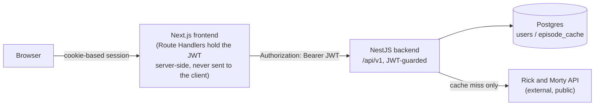
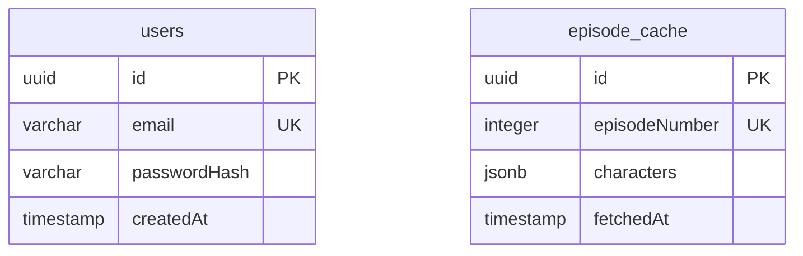

# Architecture

## System overview

## Modules

**backend/** — NestJS modular monolith, prefixed `/api`, URI-versioned
(`/api/v1/...`).

- `auth` — registration, login, password hashing (bcryptjs), JWT issuance
  (`@nestjs/jwt`), a Passport JWT strategy, and the `JwtAuthGuard` used to
  protect other modules' routes.
- `episodes` — the core feature. `GET /api/v1/episodes/:number/characters`
  is guarded by `JwtAuthGuard`. Query params: `sort` (`asc`|`desc`), `name`
  (substring filter), `page`/`limit` (pagination).
- `database` — TypeORM + Postgres wiring and checked-in migrations
  (`src/database/migrations`), run automatically on backend startup.

Every route is documented via `@nestjs/swagger` (decorators on the DTOs and
controllers) and served as interactive Swagger UI at `/docs`
(`/docs-json` for the raw OpenAPI document), mounted in `main.ts` after the
global prefix/versioning are set so the documented paths match the real
`/api/v1/...` routes.

**frontend/** — Next.js (App Router).

- `/login` — email/password form (`LoginForm`), toggles between login and
  register, posts to Route Handlers that proxy the backend.
- `/` — episode search (`EpisodeSearch`), protected by `middleware.ts`
  (redirects to `/login` when no session cookie is present).
- `app/api/*` — Route Handlers that hold the backend URL and JWT server-side:
  `auth/login` sets an httpOnly session cookie, `auth/register` and
  `auth/logout` proxy directly, `episodes/[number]` attaches the
  `Authorization: Bearer` header from the cookie before calling the backend.
  The JWT never reaches client-side JavaScript.
- Theme (`src/theme/`) and locale (`src/i18n/`) are both React contexts with
  the same shape: state persisted to `localStorage`, read back into React
  state after mount (hydration-safe — the server always renders the
  default, the client corrects itself once mounted). `Header`, `Footer`,
  `Sidebar`, `EpisodeResults`, and `LoginForm` all consume `useLocale()`;
  dark/light is pure CSS custom properties switched via a `data-theme`
  attribute on `<html>`.

## Request flow

1. User registers/logs in on `/login` → Route Handler calls the backend →
   backend returns a JWT → Route Handler stores it in an httpOnly cookie.
2. User submits an episode number on `/` → client calls
   `/api/episodes/:number` → Route Handler reads the cookie, calls the
   backend with `Authorization: Bearer <jwt>`.
3. Backend `EpisodesService` checks `episode_cache` in Postgres for that
   episode number. On a miss, it calls the Rick and Morty API for the
   episode's character URLs, fetches each character, and persists the
   result to `episode_cache` before returning it.
4. The service applies the `name` filter, sorts by `name` (`sort`),
   paginates (`page`/`limit`), and returns the page. The frontend renders
   the character list.

## Why Postgres backs both concerns

A single Postgres instance holds two unrelated tables rather than two
databases, since both are small and owned by the same monolith:

- `users` — auth module's source of truth for credentials.
- `episode_cache` — a cache of episode → character-list lookups, so a
  repeated request for the same episode doesn't re-hit the external API.

The two tables have no foreign-key relationship — `episode_cache` isn't
scoped per user, it's a shared cache of public Rick and Morty API data.

## Docker images

Each project has its own multi-stage `Dockerfile`. `docker-compose.yml` at
the repo root builds both locally by default;
[`docker-compose.ghcr.yml`](../docker-compose.ghcr.yml) runs the published
images instead (no build). `.github/workflows/docker-publish.yml` runs both
test suites on every push/PR and, on push to `master`, additionally builds
and pushes both images to GHCR (`ghcr.io/kainanguerra/rickandmorty-api-backend`
and `-frontend`), tagged `:latest` and `:<commit-sha>`.
